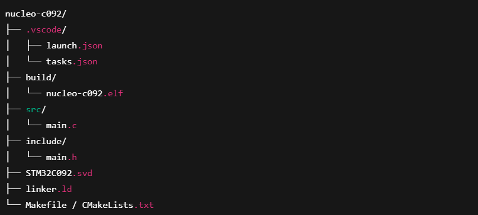
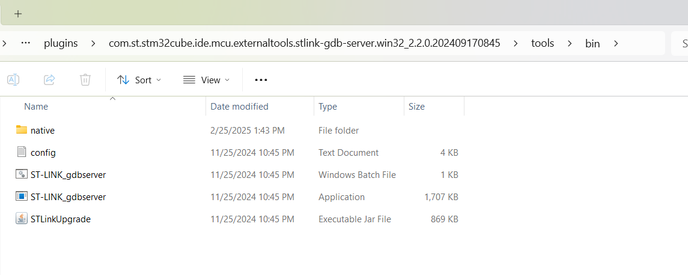
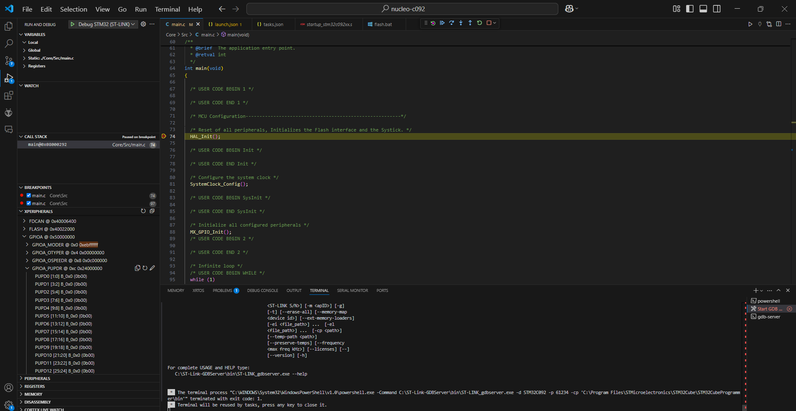

# 📘 Day001 Embedded Dev Environment Flashing and Debugging STM32 Microcontroller in VS code


## Objective

Set up a reliable embedded development environment for STM32 using VS Code, Cortex-Debug, GNU Arm Toolchain, and ST-LINK GDB server for flashing and debugging firmware. Note this setup is for STM32C092 microcontroller please update where required for other microcontrollers.


## Project Tree



## Tools Used
- VS Code
- Cortex-Debug Extension
- GNU Arm Embedded Toolchain (arm-none-eabi-gcc)
- STM32Cube Programmer CLI
- ST-LINK GDB server


## Toolcahin setup
- Install GNU Arm Embedded Toolchain -> Add it to your system PATH
- Install Cortex-Debug extention in VS code.

## Flashing Procedure 
- Download STM32Cube Programmer, we will use STM32Cube Programmer CLI.
- Set the path in environment variable.
- Now use below batch file for flashing the code from VS code.

    ```
    STM32_Programmer_CLI -c port=SWD -e all -d D:\nucleo-c092\build\nucleo-c092.elf 0x08000000 -rst
    ```

## Debugging Procedure
- For Debugging we need ST-LINK GDB server 
- If yoou are using STM32Cube IDE you can copy the folder form its directory the path is shown in below image.
  
- Set the path in environment varialble.
- Now we have to create 2 file namely launch.json and tasks.json. Below are the file.
  ```
  // launch.json
  {
    "version": "0.2.0",
    "configurations": [
      {
        "name": "Debug STM32 (ST-LINK)",
        "type": "cortex-debug",
        "request": "launch",
        "servertype": "stlink",
        "cwd": "${workspaceFolder}",
        "executable": "${workspaceFolder}/build/nucleo-c092.elf",
        "device": "STM32C0x", 
        "interface": "swd",
        "runToMain": false,
        "gdbPath": "C:/GNU_Arm_Embedded_Toolchain/10_2021_10/bin/arm-none-eabi-gdb.exe",
        "gdbTarget": "localhost:61234",
        "preLaunchTask": "Start GDB Server",
        "svdFile": "./STM32C092.svd",
        "preLaunchCommands": [
        "monitor reset"  // <- valid for ST-LINK gdbserver
      ],
        "showDevDebugOutput": "raw"
      }
    ]
  }
  ```
- Now below is the tasks.json.
  ```
  // tasks.json
  {
    "version": "2.0.0",
    "tasks": [
      {
        "label": "Start GDB Server",
        "type": "shell",
        "command": "C:\\ST-Link-GDBServer\\bin\\ST-LINK_gdbserver.exe",
        "args": [
          "-d", "STM32C092",        
          "-p", "61234",
          "-cp", "C:\\Program Files\\STMicroelectronics\\STM32Cube\\STM32CubeProgrammer\\bin"
        ],
        "isBackground": true,
        "problemMatcher": {
          "pattern": [
            {
              "regexp": ".",
              "file": 1,
              "location": 2,
              "message": 3
            }
          ],
          "background": {
            "activeOnStart": true,
            "beginsPattern": "Waiting for debugger connection",
            "endsPattern": "Connected to GDB server"
          }
        }
      }
    ]
  }
  
  ```

## Result [Debug view]
