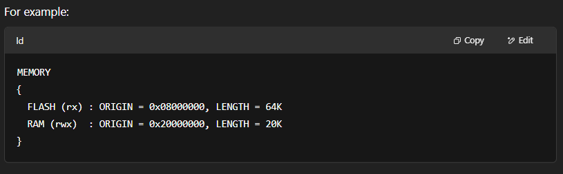
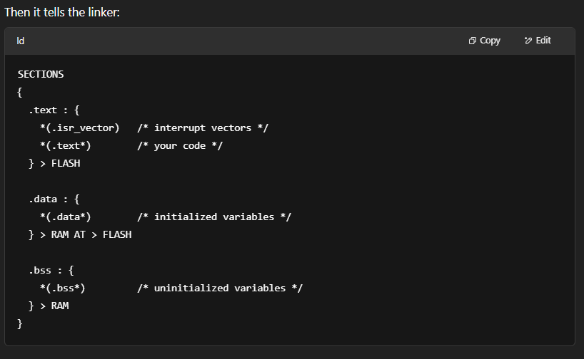

# What is Linker Script 
A linker script in a microcontroller project tells the linker how to arrange your program in memory. It’s like a map that defines where different parts of your code **(like .text, .data, .bss, etc.)** go in the microcontroller’s flash and RAM.

# In simple terms
When we working with embedded systems (like STM32 or AVR), you need to be very specific about where your code and data are stored, because resources are limited. That’s where the linker script comes in.

# Key Sections of a Linker Script:

- **FLASH:** where your code and constants go (non-volatile memory)

- **RAM:** where your variables go (volatile memory)

