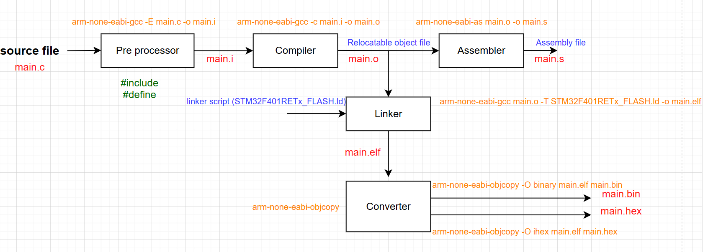

### **What is the Build Process?**

The **build process** is the step-by-step transformation of your **source code** (like `main.c`) into a **machine-readable binary** (like `.bin` or `.hex`) that you can flash onto your microcontroller.

